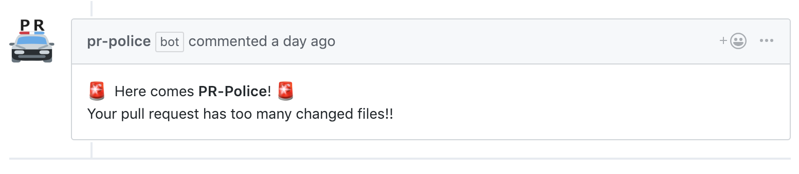

# PR-Police

PR-Police is a GitHub App.

PR-Police comments on pull request with too many changed files.




## Usage

- Install [here](https://github.com/sitateru/pr-police)

- [Option] Put config file to repository

  - Create `.github/pr-police.yml` in default branch

    example:

    ```
    threshold: 12
    message: "I am PR-Police!"
    ```

    - `threshold` : PR-Police will comment on PR if `(the number of changed files) >= threshold`.

      default is 10.

    - `message` : Comment body from PR-Police.

      default is 
      ```
      🚨 Here comes **PR-Police**! 🚨
      Your pull request has too many changed files!!
      ```
